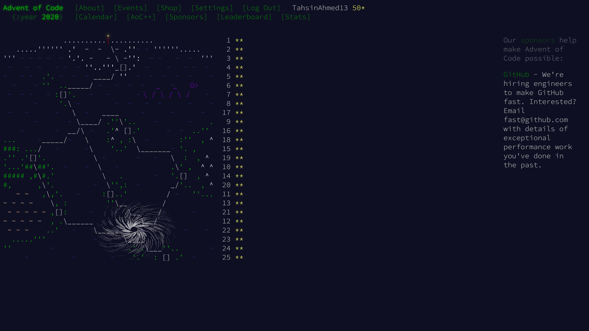

# 2020

| Day | Part 1 | Part 2 |
| --- | ------ | ------ |
| [1](https://github.com/TahsinAhmed13/Advent-of-Code/blob/main/2020/day1/main.py) | :heavy_check_mark: | :heavy_check_mark: |
| [2](https://github.com/TahsinAhmed13/Advent-of-Code/blob/main/2020/day2/main.py) | :heavy_check_mark: | :heavy_check_mark: |
| [3](https://github.com/TahsinAhmed13/Advent-of-Code/blob/main/2020/day3/main.py) | :heavy_check_mark: | :heavy_check_mark: |
| [4](https://github.com/TahsinAhmed13/Advent-of-Code/blob/main/2020/day4/main.py) | :heavy_check_mark: | :heavy_check_mark: |
| [5](https://github.com/TahsinAhmed13/Advent-of-Code/blob/main/2020/day5/main.py) | :heavy_check_mark: | :heavy_check_mark: |
| [6](https://github.com/TahsinAhmed13/Advent-of-Code/blob/main/2020/day6/main.py) | :heavy_check_mark: | :heavy_check_mark: |
| [7](https://github.com/TahsinAhmed13/Advent-of-Code/blob/main/2020/day7/main.py) | :heavy_check_mark: | :heavy_check_mark: |
| [8](https://github.com/TahsinAhmed13/Advent-of-Code/blob/main/2020/day8/main.py) | :heavy_check_mark: | :heavy_check_mark: |
| [9](https://github.com/TahsinAhmed13/Advent-of-Code/blob/main/2020/day9/main.py) | :heavy_check_mark: | :heavy_check_mark: |
| [10](https://github.com/TahsinAhmed13/Advent-of-Code/blob/main/2020/day10/main.py) | :heavy_check_mark: | :heavy_check_mark: |
| [11](https://github.com/TahsinAhmed13/Advent-of-Code/blob/main/2020/day11/main.py) | :heavy_check_mark: | :heavy_check_mark: |
| [12](https://github.com/TahsinAhmed13/Advent-of-Code/blob/main/2020/day12/main.py) | :heavy_check_mark: | :heavy_check_mark: |
| [13](https://github.com/TahsinAhmed13/Advent-of-Code/blob/main/2020/day13/main.py) | :heavy_check_mark: | :heavy_check_mark: |
| [14](https://github.com/TahsinAhmed13/Advent-of-Code/blob/main/2020/day14/main.py) | :heavy_check_mark: | :heavy_check_mark: |
| [15](https://github.com/TahsinAhmed13/Advent-of-Code/blob/main/2020/day15/main.py) | :heavy_check_mark: | :heavy_check_mark: |
| [16](https://github.com/TahsinAhmed13/Advent-of-Code/blob/main/2020/day16/main.py) | :heavy_check_mark: | :heavy_check_mark: |
| [17](https://github.com/TahsinAhmed13/Advent-of-Code/blob/main/2020/day17/main.py) | :heavy_check_mark: | :heavy_check_mark: |
| [18](https://github.com/TahsinAhmed13/Advent-of-Code/blob/main/2020/day18/main.py) | :heavy_check_mark: | :heavy_check_mark: |
| [19](https://github.com/TahsinAhmed13/Advent-of-Code/blob/main/2020/day19/main.py) | :heavy_check_mark: | :heavy_check_mark: |
| [20](https://github.com/TahsinAhmed13/Advent-of-Code/blob/main/2020/day20/main.py) | :heavy_check_mark: | :heavy_check_mark: |
| [21](https://github.com/TahsinAhmed13/Advent-of-Code/blob/main/2020/day21/main.py) | :heavy_check_mark: | :heavy_check_mark: |
| [22](https://github.com/TahsinAhmed13/Advent-of-Code/blob/main/2020/day22/main.py) | :heavy_check_mark: | :heavy_check_mark: |
| [23](https://github.com/TahsinAhmed13/Advent-of-Code/blob/main/2020/day23/main.py) | :heavy_check_mark: | :heavy_check_mark: |
| [24](https://github.com/TahsinAhmed13/Advent-of-Code/blob/main/2020/day24/main.py) | :heavy_check_mark: | :heavy_check_mark: |
| [25](https://github.com/TahsinAhmed13/Advent-of-Code/blob/main/2020/day25/main.py) | :heavy_check_mark: | :heavy_check_mark: |