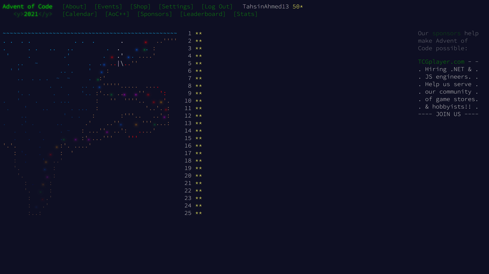

# 2021

| Day | Part 1 | Part 2 |
| --- | ------ | ------ |
| [1](https://github.com/TahsinAhmed13/Advent-of-Code/blob/main/2021/day1/Main.cpp) | :heavy_check_mark: | :heavy_check_mark: |
| [2](https://github.com/TahsinAhmed13/Advent-of-Code/blob/main/2021/day2/Main.cpp) | :heavy_check_mark: | :heavy_check_mark: |
| [3](https://github.com/TahsinAhmed13/Advent-of-Code/blob/main/2021/day3/Main.cpp) | :heavy_check_mark: | :heavy_check_mark: |
| [4](https://github.com/TahsinAhmed13/Advent-of-Code/blob/main/2021/day4/Main.cpp) | :heavy_check_mark: | :heavy_check_mark: |
| [5](https://github.com/TahsinAhmed13/Advent-of-Code/blob/main/2021/day5/Main.cpp) | :heavy_check_mark: | :heavy_check_mark: |
| [6](https://github.com/TahsinAhmed13/Advent-of-Code/blob/main/2021/day6/Main.cpp) | :heavy_check_mark: | :heavy_check_mark: |
| [7](https://github.com/TahsinAhmed13/Advent-of-Code/blob/main/2021/day7/Main.cpp) | :heavy_check_mark: | :heavy_check_mark: |
| [8](https://github.com/TahsinAhmed13/Advent-of-Code/blob/main/2021/day8/Main.cpp) | :heavy_check_mark: | :heavy_check_mark: |
| [9](https://github.com/TahsinAhmed13/Advent-of-Code/blob/main/2021/day9/Main.cpp) | :heavy_check_mark: | :heavy_check_mark: |
| [10](https://github.com/TahsinAhmed13/Advent-of-Code/blob/main/2021/day10/Main.cpp) | :heavy_check_mark: | :heavy_check_mark: |
| [11](https://github.com/TahsinAhmed13/Advent-of-Code/blob/main/2021/day11/Main.cpp) | :heavy_check_mark: | :heavy_check_mark: |
| [12](https://github.com/TahsinAhmed13/Advent-of-Code/blob/main/2021/day12/Main.cpp) | :heavy_check_mark: | :heavy_check_mark: |
| [13](https://github.com/TahsinAhmed13/Advent-of-Code/blob/main/2021/day13/Main.cpp) | :heavy_check_mark: | :heavy_check_mark: |
| [14](https://github.com/TahsinAhmed13/Advent-of-Code/blob/main/2021/day14/Main.cpp) | :heavy_check_mark: | :heavy_check_mark: |
| [15](https://github.com/TahsinAhmed13/Advent-of-Code/blob/main/2021/day15/Main.cpp) | :heavy_check_mark: | :heavy_check_mark: |
| [16](https://github.com/TahsinAhmed13/Advent-of-Code/blob/main/2021/day16/Main.cpp) | :heavy_check_mark: | :heavy_check_mark: |
| [17](https://github.com/TahsinAhmed13/Advent-of-Code/blob/main/2021/day17/Main.cpp) | :heavy_check_mark: | :heavy_check_mark: |
| [18](https://github.com/TahsinAhmed13/Advent-of-Code/blob/main/2021/day18/Main.cpp) | :heavy_check_mark: | :heavy_check_mark: |
| [19](https://github.com/TahsinAhmed13/Advent-of-Code/blob/main/2021/day19/Main.cpp) | :heavy_check_mark: | :heavy_check_mark: |
| [20](https://github.com/TahsinAhmed13/Advent-of-Code/blob/main/2021/day20/Main.cpp) | :heavy_check_mark: | :heavy_check_mark: |
| [21](https://github.com/TahsinAhmed13/Advent-of-Code/blob/main/2021/day21/Main.cpp) | :heavy_check_mark: | :heavy_check_mark: |
| [22](https://github.com/TahsinAhmed13/Advent-of-Code/blob/main/2021/day22/Main.cpp) | :heavy_check_mark: | :heavy_check_mark: |
| [23](https://github.com/TahsinAhmed13/Advent-of-Code/blob/main/2021/day23/Main.cpp) | :heavy_check_mark: | :heavy_check_mark: |
| [24](https://github.com/TahsinAhmed13/Advent-of-Code/blob/main/2021/day24/Main.cpp) | :heavy_check_mark: | :heavy_check_mark: |
| [25](https://github.com/TahsinAhmed13/Advent-of-Code/blob/main/2021/day25/Main.cpp) | :heavy_check_mark: | :heavy_check_mark: |

**NOTE**: Day24 was solved by hand. The code for it is buggy at best.